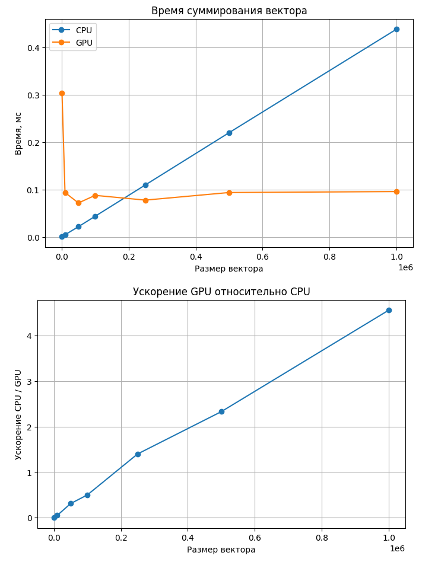

# Лабораторная работа 2. Суммирование элементов векторов 

## Цель работы

Цель работы — реализовать суммирование элементов вектора на CPU и на GPU с использованием CUDA, измерить время выполнения для разных размеров входных данных, сравнить результаты и оценить ускорение.

**Входные данные:** вектор размером от `1 000` до `1 000 000` элементов.  
**Выходные данные:** сумма элементов вектора и время вычисления.

## Описание реализации
На CPU реализовано последовательное суммирование элементов массива.На GPU используется PyTorch CUDA. 
С точки зрения параллельных вычислений на GPU распараллелено суммирование элементов вектора. Разные элементы обрабатываются одновременно большим количеством потоков GPU, после чего частичные суммы объединяются в итоговую сумму.

Распараллелена операция суммирования элементов вектора. Это эффективно на GPU, потому что:
- каждый элемент можно обрабатывать независимо;
- операция повторяется одинаково для большого числа элементов;
- GPU хорошо подходит для массовой параллельной обработки данных.

 ## Результаты эксперимента
В ноутбуке проводятся эксперименты для размеров вектора:

| Размер вектора | CPU, мс | GPU, мс | Ускорение | Эталонная сумма | Сумма CPU | Сумма GPU | CPU корректно | GPU корректно |
|---------------|---------|---------|-----------|----------------|-----------|-----------|---------------|---------------|
| 1000          | 0.001   | 0.338   | 0.00      | 490.256553     | 490.256561| 490.256553| True          | True          |
| 10000         | 0.010   | 0.207   | 0.05      | 4957.030763    | 4957.030763| 4957.030762| True         | True          |
| 50000         | 0.022   | 0.096   | 0.23      | 25017.060711   | 25017.060711| 25017.060547| True       | True          |
| 100000        | 0.044   | 0.118   | 0.37      | 50061.630279   | 50061.630279| 50061.628906| True       | True          |
| 250000        | 0.110   | 0.081   | 1.36      | 125028.753408  | 125028.753408| 125028.757812| True      | True          |
| 500000        | 0.219   | 0.093   | 2.37      | 250312.363437  | 250312.363437| 250312.359375| True      | True          |
| 1000000       | 0.438   | 0.084   | 5.22      | 499459.123219  | 499459.123219| 499459.125000| True      | True          |

## Графики 

## Вывод

В ходе работы были реализованы две версии суммирования элементов вектора:
 1) CPU - последовательное суммирование; 
 2) GPU - с использованием CUDA через PyTorch.GPU-версия выполняет параллельную редукцию суммы, где элементы обрабатываются одновременно множеством потоков.

По результатам экспериментов видно, что время работы CPU растёт линейно с увеличением размера вектора, тогда как время GPU остаётся почти постоянным, но значительно выше на малых входных данных из-за накладных расходов. На малых размерах CPU работает быстрее. 
Таким образом, CPU выгоден для небольших задач, а GPU с CUDA для больших объёмов данных, где параллелизм позволяет существенно сократить время вычислений.
